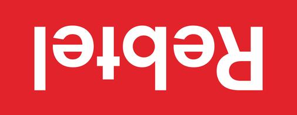

# Design Update Implementation Plan
**Date:** 2025-11-14
**Based on:** Desktop-1 design mockup (partial view)
**Focus:** Circular radiating patterns as signature visual element
**Status:** ✅ All stakeholder decisions confirmed - Ready for implementation

---

## Design Overview

### Key Visual Changes
1. **Circular Pattern System** - Concentric circles radiating outward from right side
2. **Keep Current Section Structure** - Hero, About, Services, Experience, Contact, Footer
3. **Keep SVG Logo** - Use existing logo-nav.svg and logo-hero.svg
4. **Dark Section Design** - Apply circular patterns to about section with dark background
5. **Light Section Design** - Apply circular patterns to hero section with warm tones

### Visual Style Analysis from Mockup
- **Hero:** Light background with warm circular patterns (beige → tan → orange → yellow)
- **About:** Dark background (#1D1E18) with cool circular patterns (dark purple → purple → blue)
- **Circles:** Semi-transparent, overlapping, creating depth and movement - **STATIC** (no animation)
- **Typography:** Keep Jomhuria with proper kerning, bold high-contrast headlines
- **Company Logos:** Arranged vertically on right side (in about section)

### Implementation Scope
The mockup shows two key sections with circular patterns. We will:
- Apply circular patterns to Hero and About sections as shown
- Consider applying similar patterns to other sections as appropriate
- Maintain all existing sections and navigation structure

---

## Quick Summary: What's Changing vs. What's Staying

### ✅ KEEPING (No Changes)
- All existing sections: Hero, About, Services, Experience, Contact, Footer
- Navigation structure and links
- SVG logos (logo-nav.svg, logo-hero.svg)
- Current color palette (#FDA10D accent, #1D1E18 text, etc.)
- Overall layout and content structure
- Mobile-responsive design approach

### 🎨 ADDING/UPDATING
- **Hero Section:** Add circular patterns (warm tones: beige → tan → orange → yellow)
- **About Section:**
  - Change to dark background (#1D1E18)
  - Add circular patterns (cool tones: purple → dark purple → almost black)
  - Change headline color to yellow/orange (#FDA10D)
  - Rearrange company logos vertically on right side
- **Typography:** Fix Jomhuria kerning across all headlines
- **CTA Button:** Update copy to "FIND OUT HOW" (uppercase)
- **Circles:** Static (no animation), positioned on right side, semi-transparent

### 🔧 TECHNICAL APPROACH
- CSS-based circles using `border-radius: 50%` and `position: absolute`
- `pointer-events: none` so circles don't interfere with clicks
- Mobile: Scale circles down and reduce count for performance
- Use `font-feature-settings` for proper Jomhuria kerning

---

## Phase 1: Create Circular Pattern System (Core Visual Element)

### Task 1.1: Build CSS Circular Pattern Component
**Priority:** Critical
**Files:** `styles.css`
**Complexity:** High

**Circular Pattern Specifications:**

Based on the design, the circles appear to be:
- **Count:** 5-6 concentric circles per section
- **Positioning:** Right side, radiating outward
- **Opacity:** 20-40% transparent
- **Overlap:** Each circle overlaps the previous
- **Animation:** Subtle (optional) - gentle pulsing or scaling

**Implementation Strategy:**

Create circles using CSS with `position: absolute` and `border-radius: 50%`

```css
/* ========================================
   CIRCULAR PATTERN SYSTEM
   ======================================== */

/* Container for circular patterns */
.circle-pattern {
    position: absolute;
    top: 0;
    right: 0;
    width: 100%;
    height: 100%;
    overflow: hidden;
    pointer-events: none; /* Allow clicks to pass through */
    z-index: 0;
}

/* Individual circle styling */
.circle {
    position: absolute;
    border-radius: 50%;
    opacity: 0.3;
}

/* Hero Section Circles (Warm Tones) */
.hero .circle-pattern .circle:nth-child(1) {
    width: 400px;
    height: 400px;
    background: #FDB52D; /* Lightest yellow/orange */
    top: 50%;
    right: -100px;
    transform: translateY(-50%);
}

.hero .circle-pattern .circle:nth-child(2) {
    width: 550px;
    height: 550px;
    background: #FDA10D; /* Medium orange */
    top: 50%;
    right: -150px;
    transform: translateY(-50%);
    opacity: 0.25;
}

.hero .circle-pattern .circle:nth-child(3) {
    width: 700px;
    height: 700px;
    background: #E8C9A0; /* Tan */
    top: 50%;
    right: -200px;
    transform: translateY(-50%);
    opacity: 0.2;
}

.hero .circle-pattern .circle:nth-child(4) {
    width: 850px;
    height: 850px;
    background: #E5D4BC; /* Light tan */
    top: 50%;
    right: -250px;
    transform: translateY(-50%);
    opacity: 0.15;
}

.hero .circle-pattern .circle:nth-child(5) {
    width: 1000px;
    height: 1000px;
    background: #EBE0D0; /* Very light beige */
    top: 50%;
    right: -300px;
    transform: translateY(-50%);
    opacity: 0.12;
}

/* About Section Circles (Cool/Dark Tones) */
.about .circle-pattern .circle:nth-child(1) {
    width: 400px;
    height: 400px;
    background: #3B2F8F; /* Deep purple */
    top: 50%;
    right: 10%;
    transform: translateY(-50%);
    opacity: 0.4;
}

.about .circle-pattern .circle:nth-child(2) {
    width: 550px;
    height: 550px;
    background: #2D2366; /* Darker purple */
    top: 50%;
    right: 5%;
    transform: translateY(-50%);
    opacity: 0.35;
}

.about .circle-pattern .circle:nth-child(3) {
    width: 700px;
    height: 700px;
    background: #1F1B3D; /* Very dark purple */
    top: 50%;
    right: 0%;
    transform: translateY(-50%);
    opacity: 0.3;
}

.about .circle-pattern .circle:nth-child(4) {
    width: 850px;
    height: 850px;
    background: #2A1F42; /* Dark brown-purple */
    top: 50%;
    right: -5%;
    transform: translateY(-50%);
    opacity: 0.25;
}

.about .circle-pattern .circle:nth-child(5) {
    width: 1000px;
    height: 1000px;
    background: #1A1520; /* Almost black purple */
    top: 50%;
    right: -10%;
    transform: translateY(-50%);
    opacity: 0.2;
}

/* Static circles - no animation as per requirements */
```

**HTML Structure for Circles:**
```html
<!-- Hero Section -->
<section class="hero">
    <div class="circle-pattern">
        <div class="circle"></div>
        <div class="circle"></div>
        <div class="circle"></div>
        <div class="circle"></div>
        <div class="circle"></div>
    </div>
    <div class="hero-content">
        <!-- Content here -->
    </div>
</section>

<!-- About Section -->
<section class="about-combined">
    <div class="circle-pattern">
        <div class="circle"></div>
        <div class="circle"></div>
        <div class="circle"></div>
        <div class="circle"></div>
        <div class="circle"></div>
    </div>
    <div class="about-content">
        <!-- Content here -->
    </div>
</section>
```

**Testing:**
- Verify circles don't interfere with text readability
- Test on multiple screen sizes
- Ensure pointer-events: none allows clicking through
- Adjust opacity/colors to match design mockup exactly

**Color Refinement Notes:**
The exact colors will need fine-tuning. Use the design mockup as reference and adjust hex values using:
- Color picker tool from the image
- Chrome DevTools to live-adjust values
- Compare side-by-side with mockup

---

## Phase 2: Apply Circular Patterns to Existing Sections

### Task 2.1: Keep Navigation As-Is
**Priority:** Low
**File:** `index.html`
**Lines:** 14-26

**No Changes Required:**
- Keep existing SVG logo (`logo-nav.svg`)
- Keep current navigation structure
- Navigation already follows design principles

**Current navigation is correct:**
```html
<nav>
    <a href="/" class="logo">
        
    </a>
    <ul class="nav-links">
        <li><a href="#about">About</a></li>
        <li><a href="#services">Services</a></li>
        <li><a href="#experience">Experience</a></li>
        <li><a href="#contact">Contact</a></li>
    </ul>
</nav>
```

**Note:** The mockup text-based "AARDVARK" logo appears to be a design exploration. Stakeholder confirmed to use existing SVG logo.

---

### Task 2.2: Redesign Hero Section with Circles
**Priority:** Critical
**File:** `index.html`, `styles.css`
**Lines:** index.html 28-36, styles.css 73-128

**New Hero HTML:**
```html
<section class="hero">
    <!-- Circular patterns -->
    <div class="circle-pattern">
        <div class="circle"></div>
        <div class="circle"></div>
        <div class="circle"></div>
        <div class="circle"></div>
        <div class="circle"></div>
    </div>

    <!-- Content -->
    <div class="hero-content">
        <h1>Go from 100K<br>to 10M+ Users</h1>
        <p class="tagline">Product strategy and leadership that scales—proven at Spotify, Electrolux, and beyond</p>
        <a href="#contact" class="cta-button">FIND OUT HOW</a>
    </div>
</section>
```

**New Hero CSS:**
```css
.hero {
    position: relative;
    background: #F8FAF9; /* Keep light background */
    padding: 8rem 2rem 8rem 6rem; /* More left padding */
    min-height: 600px;
    display: flex;
    align-items: center;
    overflow: hidden; /* Clip circles at edges */
}

.hero-content {
    position: relative;
    z-index: 1; /* Above circles */
    max-width: 600px;
}

.hero h1 {
    font-size: 5.5rem;
    font-weight: 800; /* Heavy weight for impact */
    line-height: 1;
    letter-spacing: -0.02em;
    color: #1D1E18;
    margin-bottom: 1.5rem;
}

.hero .tagline {
    font-size: 1.125rem;
    line-height: 1.6;
    color: #6b7280;
    margin-bottom: 2.5rem;
    max-width: 500px;
}

.cta-button {
    display: inline-block;
    background: #FDA10D;
    color: #1D1E18;
    padding: 1rem 2.5rem;
    text-decoration: none;
    border-radius: 4px; /* Slightly less rounded than current */
    font-weight: 700;
    font-size: 0.875rem;
    letter-spacing: 0.05em;
    text-transform: uppercase;
    transition: all 0.2s;
    box-shadow: none; /* Flatter design */
}

.cta-button:hover {
    background: #FDB52D;
    transform: translateY(-2px);
    box-shadow: 0 4px 12px rgba(253, 161, 13, 0.3);
}

/* Responsive */
@media (max-width: 768px) {
    .hero {
        padding: 5rem 2rem;
        min-height: 500px;
    }

    .hero h1 {
        font-size: 3rem;
    }

    /* Reduce circle sizes on mobile */
    .hero .circle-pattern .circle {
        transform: translateY(-50%) scale(0.6);
    }
}
```

---

### Task 2.3: Update About Section with Dark Background and Circular Patterns
**Priority:** High
**Files:** `index.html`, `styles.css`

**Design Analysis:**
The mockup shows the about section with:
- Dark background (#1D1E18 or similar)
- Yellow/orange headline: "15 Years Building Products That Matter"
- Body text: Career summary
- Company logos: Arranged vertically on right side (not centered row)
- Cool-toned circular patterns (purples/blues)

**Updated HTML Structure:**
```html
<section id="about" class="about">
    <!-- Circular patterns (dark/purple tones) -->
    <div class="circle-pattern">
        <div class="circle"></div>
        <div class="circle"></div>
        <div class="circle"></div>
        <div class="circle"></div>
        <div class="circle"></div>
    </div>

    <div class="container">
        <div class="about-grid">
            <!-- Left: Text content -->
            <div class="about-text">
                <h2>15 Years Building<br>Products That Matter</h2>
                <p>I've led product strategy and launches at some of the world's most innovative companies. From scaling Spotify's wearables from 100K to 10M+ users globally, to defining multi-year digital strategies for Electrolux's global appliance platforms, to pioneering ML solutions that increased sales by 80% at Fyndiq—I bring hands-on experience taking products from idea to market success.</p>
            </div>

            <!-- Right: Company logos (clickable, link to top of page) -->
            <div class="company-logos-vertical">
                <a href="#" aria-label="Spotify">
                    
                </a>
                <a href="#" aria-label="Electrolux">
                    
                </a>
                <a href="#" aria-label="Kry">
                    
                </a>
                <a href="#" aria-label="Truecaller">
                    
                </a>
                <a href="#" aria-label="Fyndiq">
                    
                </a>
                <a href="#" aria-label="Rebtel">
                    
                </a>
            </div>
        </div>
    </div>
</section>
```

**Updated CSS:**
```css
.about {
    position: relative;
    background: #1D1E18; /* Very dark background */
    padding: 6rem 2rem;
    overflow: hidden;
    min-height: 600px;
    display: flex;
    align-items: center;
}

.about-grid {
    position: relative;
    z-index: 1;
    display: grid;
    grid-template-columns: 1.5fr 1fr;
    gap: 4rem;
    align-items: center;
}

.about-text h2 {
    font-family: 'Jomhuria', serif;
    font-size: 3.5rem;
    font-weight: 400; /* Jomhuria is naturally bold */
    color: #FDA10D; /* Yellow/orange headline */
    margin-bottom: 2rem;
    line-height: 1.1;
    letter-spacing: -0.02em;
}

.about-text p {
    font-size: 1rem;
    line-height: 1.7;
    color: #E5E5E5; /* Light gray text on dark */
    max-width: 600px;
}

/* Company logos - vertical arrangement */
.company-logos-vertical {
    display: flex;
    flex-direction: column;
    gap: 2rem;
    align-items: flex-start;
}

.company-logos-vertical a {
    display: inline-block;
    text-decoration: none;
}

.company-logo-dark {
    height: 40px;
    width: auto;
    object-fit: contain;
    filter: brightness(0) invert(1); /* White logos */
    opacity: 0.8;
    transition: opacity 0.2s, transform 0.2s;
}

.company-logos-vertical a:hover .company-logo-dark {
    opacity: 1;
    transform: translateX(4px); /* Subtle slide on hover */
}

/* Responsive */
@media (max-width: 768px) {
    .about-grid {
        grid-template-columns: 1fr;
        gap: 3rem;
    }

    .about-text h2 {
        font-size: 2.5rem;
    }

    .company-logos-vertical {
        flex-direction: row;
        flex-wrap: wrap;
        justify-content: center;
        gap: 1.5rem;
    }

    .company-logo-dark {
        height: 32px;
    }

    /* Reduce circle sizes on mobile */
    .about .circle-pattern .circle {
        transform: translateY(-50%) scale(0.5);
    }
}
```

**Note:** This updates the existing about section. Keep Services, Experience, and Contact sections as-is.

---

## Phase 3: Typography & Style Refinements

### Task 3.1: Fix Jomhuria Kerning and Typography Hierarchy
**Priority:** High
**File:** `styles.css`

**Key Changes:**
1. Hero H1: Keep Jomhuria, fix kerning for proper character spacing
2. About H2: Keep Jomhuria with proper kerning, yellow/orange color
3. Body text: Adjust for dark background readability

**Jomhuria Kerning Issue:**
Jomhuria can have tight or awkward spacing between certain letter pairs. Fix with:
- `letter-spacing` adjustment
- `font-feature-settings` for OpenType kerning
- Testing specific word combinations

```css
/* Hero typography - Jomhuria with proper kerning */
.hero h1 {
    font-family: 'Jomhuria', serif;
    font-size: 5rem;
    font-weight: 400; /* Jomhuria is naturally bold */
    line-height: 1.1;
    letter-spacing: -0.02em; /* Adjust based on visual testing */
    color: #1D1E18;
    /* Enable OpenType kerning features */
    font-feature-settings: "kern" 1;
    text-rendering: optimizeLegibility;
}

/* About typography - yellow headline with Jomhuria */
.about h2 {
    font-family: 'Jomhuria', serif;
    font-size: 3.5rem;
    font-weight: 400;
    line-height: 1.1;
    color: #FDA10D; /* Yellow/orange */
    letter-spacing: -0.02em; /* Test and adjust */
    font-feature-settings: "kern" 1;
    text-rendering: optimizeLegibility;
}

/* Body text on dark background */
.about p {
    font-size: 1rem;
    line-height: 1.7;
    color: #E5E5E5;
    font-weight: 300; /* Lighter weight for elegance */
}
```

**Kerning Testing Process:**
1. View page with actual content
2. Check letter pairs: "Go", "fr", "om", "10", "0K", "M+", etc.
3. Adjust `letter-spacing` in small increments (-0.01em, -0.02em, -0.03em)
4. Test at different screen sizes
5. Compare to mockup visually

**Specific Kerning Adjustments:**
If specific headlines need different spacing:
```css
/* Fine-tune specific headlines if needed */
.hero h1 {
    letter-spacing: -0.025em; /* Custom value after testing */
}

.about h2 {
    letter-spacing: -0.015em; /* May differ from hero */
}
```

---

### Task 3.2: Refine CTA Button Style
**Priority:** Medium
**File:** `styles.css`

**Design Details:**
- Uppercase text: "FIND OUT HOW"
- Orange/yellow background
- Minimal shadow (flatter design)
- Slightly less rounded corners

```css
.cta-button {
    display: inline-block;
    background: #FDA10D;
    color: #1D1E18;
    padding: 1rem 2.5rem;
    text-decoration: none;
    border-radius: 4px; /* Less rounded */
    font-weight: 700;
    font-size: 0.875rem;
    letter-spacing: 0.08em;
    text-transform: uppercase;
    transition: all 0.2s;
    box-shadow: none; /* No shadow */
    border: none;
}

.cta-button:hover {
    background: #FDB52D;
    transform: translateY(-2px);
    box-shadow: 0 6px 16px rgba(253, 161, 13, 0.25);
}

.cta-button:active {
    transform: translateY(0);
}
```

---

## Phase 4: Responsive & Polish

### Task 4.1: Mobile Optimization for Circles
**Priority:** High
**File:** `styles.css`

**Approach: Conservative (Not Aggressive)**
Per stakeholder decision: Keep most circles visible on mobile, just scale them down appropriately.

**Strategy:**
- Keep all 5 circles on tablet (768px-1024px)
- Keep 4-5 circles on mobile (480px-767px)
- Only hide outermost circle on very small screens (<480px)
- Scale circles proportionally to screen size

**Implementation:**
```css
@media (max-width: 1024px) {
    /* Tablet: Keep all circles, slight scale reduction */
    .circle-pattern .circle {
        transform: translateY(-50%) scale(0.85) !important;
    }
}

@media (max-width: 768px) {
    /* Mobile: Keep most circles, moderate scaling */
    .circle-pattern .circle {
        transform: translateY(-50%) scale(0.7) !important;
    }

    /* Optionally hide only the outermost (largest) circle */
    .circle-pattern .circle:nth-child(5) {
        display: none;
    }

    /* Adjust positioning to keep circles visible */
    .hero .circle-pattern {
        right: -30%;
    }

    .about .circle-pattern {
        right: -25%;
    }
}

@media (max-width: 480px) {
    /* Very small screens: More scaling, hide one more circle */
    .circle-pattern .circle {
        transform: translateY(-50%) scale(0.6) !important;
    }

    /* Hide outermost two circles */
    .circle-pattern .circle:nth-child(4),
    .circle-pattern .circle:nth-child(5) {
        display: none;
    }

    /* Keep 3 circles visible at minimum */
}
```

**Testing:**
- Verify circles don't create horizontal scroll
- Ensure visual impact is maintained
- Check that 3+ circles are visible even on iPhone SE (375px)
```

---

### Task 4.2: Performance Optimization
**Priority:** Medium

**Strategies:**

1. **Use CSS transforms for circles** (GPU accelerated)
   - ✓ Already using transform in implementation

2. **Consider SVG instead of div circles**
   - More performant for complex patterns
   - Better scaling

**SVG Alternative:**
```html
<svg class="circle-pattern" xmlns="http://www.w3.org/2000/svg" viewBox="0 0 1200 800">
    <circle cx="900" cy="400" r="200" fill="#FDB52D" opacity="0.3"/>
    <circle cx="900" cy="400" r="275" fill="#FDA10D" opacity="0.25"/>
    <circle cx="900" cy="400" r="350" fill="#E8C9A0" opacity="0.2"/>
    <circle cx="900" cy="400" r="425" fill="#E5D4BC" opacity="0.15"/>
    <circle cx="900" cy="400" r="500" fill="#EBE0D0" opacity="0.12"/>
</svg>
```

```css
.circle-pattern {
    position: absolute;
    top: 0;
    right: -10%;
    width: 100%;
    height: 100%;
    pointer-events: none;
    z-index: 0;
}
```

3. **Use will-change for animations**
```css
.circle {
    will-change: transform;
}
```

---

## Phase 5: Color Calibration & Final Polish

### Task 5.1: Define Circle Colors Using Current Brand Palette
**Priority:** High
**Approach:** Use current brand colors (#FDA10D accent, #1D1E18 dark, etc.)

**Per Stakeholder Decision:** Don't extract colors from mockup - use existing brand colors with opacity adjustments.

**Hero Circles (Warm - Based on #FDA10D):**
Use variations of the brand accent color with different opacities:

```css
/* Warm circle colors derived from brand accent #FDA10D */
.hero .circle-pattern .circle:nth-child(1) {
    background: #FDA10D; /* Brand accent */
    opacity: 0.3;
}

.hero .circle-pattern .circle:nth-child(2) {
    background: #FDA10D;
    opacity: 0.25;
}

.hero .circle-pattern .circle:nth-child(3) {
    background: #E8C9A0; /* Lighter tan variation */
    opacity: 0.2;
}

.hero .circle-pattern .circle:nth-child(4) {
    background: #E5D4BC; /* Very light tan */
    opacity: 0.15;
}

.hero .circle-pattern .circle:nth-child(5) {
    background: #EBE0D0; /* Pale beige */
    opacity: 0.12;
}
```

**About Circles (Cool/Dark - Purple tones):**
Create subtle purple variations that complement the dark background:

```css
/* Cool circle colors for dark section */
.about .circle-pattern .circle:nth-child(1) {
    background: #5842C3; /* Medium purple */
    opacity: 0.3;
}

.about .circle-pattern .circle:nth-child(2) {
    background: #3B2F8F; /* Darker purple */
    opacity: 0.25;
}

.about .circle-pattern .circle:nth-child(3) {
    background: #2D2366; /* Deep purple */
    opacity: 0.2;
}

.about .circle-pattern .circle:nth-child(4) {
    background: #1F1B3D; /* Very dark purple */
    opacity: 0.15;
}

.about .circle-pattern .circle:nth-child(5) {
    background: #1A1520; /* Almost black */
    opacity: 0.12;
}
```

**Note:** These colors create the warm/cool tone variations shown in mockup while maintaining brand consistency. Adjust opacity values during testing to achieve desired visual effect.

---

### Task 5.2: Fine-Tune Circle Positioning
**Priority:** High

**Process:**
1. Implement initial circle system
2. Open side-by-side with mockup
3. Adjust:
   - Circle sizes (width/height)
   - Positioning (top, right values)
   - Opacity levels
   - Overlap amount
4. Iterate until visually matching

**Testing Checklist:**
- [ ] Circles radiate from right side
- [ ] Largest circles extend beyond viewport edge
- [ ] Circles don't block text readability
- [ ] Smooth transition between circle colors
- [ ] Mobile circles scale appropriately

---

## Implementation Order

### Week 1: Core Circular System & Layout Updates
1. **Day 1-2:** Build circular pattern CSS system (Task 1.1)
2. **Day 2-3:** Implement hero section with circles (Task 2.2)
3. **Day 3-4:** Update about section with dark background and circles (Task 2.3)
4. **Day 4-5:** Color calibration and positioning refinement (Task 5.1, 5.2)

### Week 2: Typography & Polish
5. **Day 1-2:** Fix Jomhuria kerning across all headlines (Task 3.1)
6. **Day 2-3:** Refine CTA button styling (Task 3.2)
7. **Day 3-4:** Mobile responsive adjustments (Task 4.1)
8. **Day 4-5:** Performance optimization and final testing (Task 4.2)

**Note:** All existing sections (Services, Experience, Contact) remain unchanged. Focus is on adding circular patterns to Hero and About sections as shown in mockup.

---

## Technical Considerations

### Browser Compatibility
- **CSS circles:** Excellent support (border-radius)
- **Transform:** Excellent support
- **Backdrop-filter:** Good support (nav)
- **Animations:** Excellent support

**Fallbacks:**
- Reduce or remove circles on IE11 (if supporting)
- Simpler layout for older browsers

### Performance Metrics
- **Target:** Same or better load time (<2s)
- **Lighthouse Score:** Maintain 90+ performance
- **Mobile:** Optimize circle count and animations

### Accessibility
- **Circles:** Decorative, use aria-hidden="true"
- **Color contrast:** Verify text on circle backgrounds
- **Focus states:** Maintain keyboard navigation
- **Screen readers:** Ensure circles don't interfere

---

## Testing Checklist

### Visual
- [ ] Circles match mockup design
- [ ] Colors accurately reproduced
- [ ] Spacing and proportions correct
- [ ] Typography hierarchy clear

### Responsive
- [ ] Desktop (1280px+) - full circles
- [ ] Tablet (768px-1024px) - scaled circles
- [ ] Mobile (320px-767px) - reduced circles
- [ ] No horizontal scroll at any size

### Performance
- [ ] Page loads in <2 seconds
- [ ] Smooth scrolling with circles
- [ ] No layout shift
- [ ] Animations performant (60fps)

### Cross-Browser
- [ ] Chrome/Edge (latest)
- [ ] Firefox (latest)
- [ ] Safari (latest)
- [ ] Mobile browsers (iOS Safari, Chrome Mobile)

### Accessibility
- [ ] Keyboard navigation works
- [ ] Screen reader doesn't read circles
- [ ] Text contrast sufficient on all backgrounds
- [ ] Focus states visible

---

## Rollback Plan

If circular pattern system causes issues:

1. **Keep structure, remove circles**
   - Comment out `.circle-pattern` HTML
   - Use solid background colors

2. **Fallback to gradient backgrounds**
   ```css
   .hero {
       background: linear-gradient(135deg, #F8FAF9 0%, #EBE0D0 100%);
   }

   .about-combined {
       background: linear-gradient(135deg, #1D1E18 0%, #2A1F42 100%);
   }
   ```

3. **Revert to current design**
   - Git revert to previous commit
   - Keep learnings for future iterations

---

## Stakeholder Decisions (All Confirmed) ✅

1. **Typography:** ✓ Keep Jomhuria - be mindful of correct kerning
2. **CTA Copy:** "FIND OUT HOW" (as shown in mockup)
3. **Sections:** ✓ Keep all sections (Services, Experience, Contact)
4. **Animation:** ✓ Start with static circles (no animation)
5. **Logo:** ✓ Use existing SVG logo (logo-nav.svg, logo-hero.svg)
6. **Navigation:** ✓ Keep current navigation structure
7. **Circular patterns scope:** ✓ Keep on Hero and About sections only (not Services, Experience, Contact)
8. **Company logos:** ✓ Clickable - should link to home/top of landing page (#)
9. **Mobile circles:** ✓ Not aggressive - keep most circles, just scale down (0.7x on mobile, 0.6x on small)
10. **Colors:** ✓ Use current brand colors (#FDA10D, etc.) - don't extract from mockup

### Implementation Summary
- **Add circular patterns** to Hero (warm tones) and About (cool tones) sections
- **Update About section** with dark background and vertical logo layout
- **Fix Jomhuria kerning** across all headlines with font-feature-settings
- **Make logos clickable** with subtle hover animation
- **Keep circles static** - no CSS animations
- **Use brand colors** with opacity variations for circle patterns
- **Conservative mobile** - scale to 70% on mobile, 60% on small screens, hide max 2 circles

---

## Success Criteria

### Must Have
- ✓ Circular pattern system implemented and performant (static, no animation)
- ✓ Hero section with warm-toned circular patterns
- ✓ About section with dark background, cool-toned circular patterns, and yellow headline
- ✓ Keep existing SVG logo in navigation
- ✓ Company logos arranged vertically on right side of about section
- ✓ Proper Jomhuria kerning across all headlines
- ✓ All existing sections maintained (Services, Experience, Contact)

### Nice to Have
- Circular patterns on additional sections (Services, Experience, Contact)
- SVG-based circles for better performance (vs. CSS divs)
- Enhanced micro-interactions
- Gradient overlays on circles for smoother transitions

### Measurements
- Visual match to mockup: 90%+ similarity (Hero and About sections)
- Performance: Lighthouse score 90+ (maintain or improve)
- Load time: <2 seconds (maintain current performance)
- Mobile score: 90+
- Accessibility: WCAG AA compliant (maintain current standards)
- Jomhuria rendering: Clean kerning, no awkward letter spacing

---

**Ready to implement?** Start with Phase 1 (Circular Pattern System) and iterate from there. The circles are the signature element of this design - get them right first, then build everything around them.
