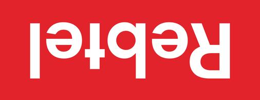

# Design QA Audit & Improvement Tasks
**Date:** 2025-11-14
**Auditor:** Claude Code (Design QA Review)
**Project:** Aardvark Product Management Website

## Context for Implementation

This audit compares the current website (`index.html` + `styles.css`) against design principles documented in `DESIGN-PRINCIPLES.md`. Each task below includes:
- Specific file locations and line numbers
- Issue description and violated design principle
- Concrete implementation steps

**Before starting:** Read `DESIGN-PRINCIPLES.md` and `CLAUDE.md` for full context.

**Working approach:** Work through tasks sequentially by priority level. Test changes locally with `open index.html` before committing.

---

## Critical Issues (Must Fix)

### Task 1: Add keyboard focus states
**Priority:** Critical
**File:** `styles.css`
**Lines affected:** Create new section after line 71
**Issue:** No visible focus states for keyboard navigation violates WCAG accessibility standards
**Design Principle:** "Accessibility First - Include focus states for keyboard navigation" (DESIGN-PRINCIPLES.md:72)

**Implementation:**
```css
/* Add after nav-links hover styles */
.nav-links a:focus-visible,
.cta-button:focus-visible,
.contact-email a:focus-visible {
    outline: 2px solid #FDA10D;
    outline-offset: 4px;
    border-radius: 2px;
}

/* Ensure no default outline suppression */
*:focus-visible {
    outline: 2px solid #FDA10D;
    outline-offset: 2px;
}
```

**Testing:** Tab through all interactive elements and verify visible focus indicator appears.

---

### Task 2: Verify and document color contrast ratios
**Priority:** Critical
**File:** `styles.css` (all text elements)
**Issue:** No verification that color combinations meet WCAG AA standards (4.5:1 for normal text, 3:1 for large text)
**Design Principle:** "Ensure sufficient color contrast for readability" (DESIGN-PRINCIPLES.md:73)

**Implementation:**
1. Test these combinations using WebAIM Contrast Checker or Chrome DevTools:
   - `#1D1E18` on `#ffffff` (main text on white)
   - `#1D1E18` on `#fafafa` (main text on light gray)
   - `#6b7280` on `#ffffff` (secondary text on white)
   - `#6b7280` on `#fafafa` (secondary text on light gray)
   - `#1D1E18` on `#FDA10D` (button text on accent)
   - `#4b5563` on `#ffffff` (nav links on white)

2. Document results in a comment block at top of `styles.css`:
```css
/*
 * COLOR CONTRAST AUDIT (WCAG AA Compliance)
 * Tested: 2025-11-14
 *
 * #1D1E18 on #ffffff: [ratio] - [PASS/FAIL]
 * #6b7280 on #ffffff: [ratio] - [PASS/FAIL]
 * [etc...]
 */
```

3. Fix any failing combinations by darkening text color or lightening background.

**Testing:** Use browser DevTools accessibility checker on all text elements.

---

### Task 3: Add explicit "Home" link to navigation
**Priority:** Critical
**File:** `index.html`
**Lines affected:** 19-24 (nav section)
**Issue:** Only logo links to home, missing explicit "Home" text link
**Design Principle:** "Navigation Best Practices - Include both logo link AND explicit 'Home' link" (DESIGN-PRINCIPLES.md:147)

**Implementation:**
```html
<ul class="nav-links">
    <li><a href="/">Home</a></li>
    <li><a href="#about">About</a></li>
    <li><a href="#services">Services</a></li>
    <li><a href="#experience">Experience</a></li>
    <li><a href="#contact">Contact</a></li>
</ul>
```

**Testing:** Verify "Home" link appears in navigation and refreshes page when clicked.

---

## High Priority (Usability & Design System)

### Task 4: Reduce accent color usage to meet 10% rule
**Priority:** High
**Files:** `styles.css`
**Lines affected:** 220 (service h3), 272 (experience role), 301 (metric-number), 340 (email link)
**Issue:** Accent color (#FDA10D) overused throughout design
**Design Principle:** "The 10% Accent Rule - Accent colors should appear in ~10% of the design" (DESIGN-PRINCIPLES.md:128-134)

**Current accent usage:**
- Service card titles (4 instances)
- Experience roles (5 instances)
- Metric numbers (3 instances)
- Email link
- CTA button (appropriate)
- Hover states (appropriate)

**Implementation:**
```css
/* Change line 220 - service card h3 */
.service-card h3 {
    color: #1D1E18;  /* Changed from #FDA10D */
    font-size: 1.5rem;
    font-weight: 700;
    margin-bottom: 0.75rem;
    letter-spacing: -0.01em;
}

/* Change line 272 - experience role */
.experience-item .role {
    color: #6b7280;  /* Changed from #FDA10D */
    font-size: 0.9375rem;
    font-weight: 600;
    margin-bottom: 0.75rem;
}

/* Keep line 301 metric-number as #FDA10D - appropriate accent use */
/* Keep line 340 email link as #FDA10D - appropriate accent use */
```

**Testing:** Visually verify accent color appears in approximately 10% of page elements (CTA button, metrics, email link, hover states only).

---

### Task 5: Fix Jomhuria font-weight inconsistencies
**Priority:** High
**File:** `styles.css`
**Lines affected:** 91, 137, 189, 239, 267, 320
**Issue:** Headlines use font-weight 700-800, but Jomhuria is naturally bold and should use 400
**Design Principle:** CLAUDE.md:85-86 "Hero headline: 5rem (80px), weight 400 (Jomhuria is naturally bold)"

**Implementation:**
```css
/* Line 91 - hero h1 */
.hero-content h1 {
    font-size: 5rem;
    font-weight: 400;  /* Changed from 800 */
    /* ... rest unchanged */
}

/* Lines 137, 189, 239, 320 - all section h2 */
.about h2,
.services h2,
.experience h2,
.contact h2 {
    font-weight: 400;  /* Changed from 700 */
    /* ... rest unchanged */
}

/* Line 267 - experience h3 */
.experience-item h3 {
    font-weight: 400;  /* Changed from 700 */
    /* ... rest unchanged */
}

/* Also fix line 222 - service h3 if using Jomhuria */
.service-card h3 {
    font-weight: 400;  /* Changed from 700 */
    /* ... rest unchanged */
}
```

**Testing:** Verify headlines still look visually bold (Jomhuria's natural weight) without explicit font-weight.

---

### Task 6: Add scroll indicator below hero section
**Priority:** High
**File:** `index.html` and `styles.css`
**Lines affected:** index.html line 35 (before closing hero-content div), new CSS section
**Issue:** No visual cue that more content exists below the fold
**Design Principle:** "Content Before Chrome - Guide users to scroll by indicating more content below, avoid 'false floors'" (DESIGN-PRINCIPLES.md:43)

**Implementation HTML:**
```html
<!-- Add before closing </div> of hero-content -->
<div class="scroll-indicator">
    <span class="scroll-arrow">↓</span>
    <span class="scroll-text">Scroll to explore</span>
</div>
```

**Implementation CSS:**
```css
/* Add after hero section styles */
.scroll-indicator {
    margin-top: 4rem;
    display: flex;
    flex-direction: column;
    align-items: center;
    gap: 0.5rem;
    opacity: 0.6;
    animation: scrollBounce 2s ease-in-out infinite;
}

.scroll-arrow {
    font-size: 2rem;
    color: #FDA10D;
}

.scroll-text {
    font-size: 0.875rem;
    color: #6b7280;
    text-transform: uppercase;
    letter-spacing: 0.1em;
}

@keyframes scrollBounce {
    0%, 100% {
        transform: translateY(0);
    }
    50% {
        transform: translateY(8px);
    }
}

/* Hide on mobile to save space */
@media (max-width: 768px) {
    .scroll-indicator {
        display: none;
    }
}
```

**Testing:** Verify smooth bounce animation appears on desktop, hidden on mobile.

---

### Task 7: Make navigation labels more descriptive
**Priority:** High
**File:** `index.html`
**Lines affected:** 20-23
**Issue:** Generic labels like "Services" don't communicate specific value
**Design Principle:** "Use descriptive labels (not 'Products' but 'Project Management Tools')" (DESIGN-PRINCIPLES.md:148)

**Current vs. Proposed:**
- "About" → Keep as is (clear)
- "Services" → "What I Offer" or "Product Leadership"
- "Experience" → "Track Record" (matches h2 on page for consistency)
- "Contact" → Keep as is (clear)

**Implementation:**
```html
<ul class="nav-links">
    <li><a href="/">Home</a></li>
    <li><a href="#about">About</a></li>
    <li><a href="#services">What I Offer</a></li>
    <li><a href="#experience">Track Record</a></li>
    <li><a href="#contact">Contact</a></li>
</ul>
```

**Note:** This is a suggestion. Consult with stakeholder on final labels before implementing.

**Testing:** Verify labels are scannable and communicate value at a glance.

---

### Task 8: Standardize card padding
**Priority:** High
**File:** `styles.css`
**Lines affected:** 207, 258
**Issue:** service-card has 2.5rem padding, experience-item has 2rem padding
**Design Principle:** "Consistency Throughout - Use standardized design tokens" (DESIGN-PRINCIPLES.md:66)

**Implementation:**
```css
/* Line 207 - keep as is */
.service-card {
    background: #ffffff;
    padding: 2.5rem;  /* Standard card padding */
    /* ... rest unchanged */
}

/* Line 258 - update to match */
.experience-item {
    background: #ffffff;
    padding: 2.5rem;  /* Changed from 2rem */
    /* ... rest unchanged */
}
```

**Testing:** Visually verify cards have consistent internal spacing across sections.

---

### Task 9: Add primary CTA button to Contact section
**Priority:** High
**File:** `index.html` and `styles.css`
**Lines affected:** index.html line 130 (after main paragraph), new CSS if needed
**Issue:** Contact section only has email link, no prominent CTA button
**Design Principle:** "Clear Calls to Action - Make CTAs visually distinct" (DESIGN-PRINCIPLES.md:59)

**Implementation HTML:**
```html
<section id="contact" class="contact">
    <div class="container">
        <h2>Let's Build Something Great</h2>
        <p>Whether you're launching a new product, scaling to millions of users, or building a world-class product team—let's talk about how I can help.</p>

        <!-- ADD THIS -->
        <a href="mailto:info@aardvark.pm" class="cta-button" style="margin: 2rem 0 1.5rem 0;">Book a Free Consultation</a>

        <p class="contact-email">Email: <a href="mailto:info@aardvark.pm">info@aardvark.pm</a></p>
    </div>
</section>
```

**Alternative:** Move email to smaller text below button, or remove email link entirely and rely on button.

**Testing:** Verify CTA button is visually prominent and email link is still accessible.

---

## Medium Priority (Enhancement & Polish)

### Task 10: Expand footer with comprehensive information
**Priority:** Medium
**File:** `index.html` and `styles.css`
**Lines affected:** index.html lines 135-137, new CSS section
**Issue:** Footer only contains copyright, missing secondary navigation and contact info
**Design Principle:** "Layout Patterns - Footer: Contact info, secondary links, legal" (DESIGN-PRINCIPLES.md:167)

**Implementation HTML:**
```html
<footer>
    <div class="footer-content">
        <div class="footer-section">
            <h4>Aardvark Product Management AB</h4>
            <p>Expert product leadership for scaling companies</p>
        </div>

        <div class="footer-section">
            <h4>Quick Links</h4>
            <ul class="footer-links">
                <li><a href="#about">About</a></li>
                <li><a href="#services">Services</a></li>
                <li><a href="#experience">Experience</a></li>
                <li><a href="#contact">Contact</a></li>
            </ul>
        </div>

        <div class="footer-section">
            <h4>Get in Touch</h4>
            <p>Email: <a href="mailto:info@aardvark.pm">info@aardvark.pm</a></p>
            <p>Based in Sweden</p>
        </div>
    </div>

    <div class="footer-bottom">
        <p>&copy; 2025 Aardvark Product Management AB. All rights reserved.</p>
    </div>
</footer>
```

**Implementation CSS:**
```css
footer {
    background: #1D1E18;
    color: #9ca3af;
    padding: 3rem 2rem 1.5rem 2rem;
    font-size: 0.9375rem;
}

.footer-content {
    display: grid;
    grid-template-columns: repeat(auto-fit, minmax(200px, 1fr));
    gap: 3rem;
    max-width: 1280px;
    margin: 0 auto 2rem auto;
}

.footer-section h4 {
    color: #ffffff;
    font-size: 1.125rem;
    margin-bottom: 1rem;
    font-family: 'Oxygen', sans-serif;
    font-weight: 600;
}

.footer-links {
    list-style: none;
    padding: 0;
}

.footer-links li {
    margin-bottom: 0.5rem;
}

.footer-links a,
.footer-section a {
    color: #9ca3af;
    text-decoration: none;
    transition: color 0.2s;
}

.footer-links a:hover,
.footer-section a:hover {
    color: #FDA10D;
}

.footer-bottom {
    text-align: center;
    padding-top: 2rem;
    border-top: 1px solid rgba(255, 255, 255, 0.1);
    max-width: 1280px;
    margin: 0 auto;
}

@media (max-width: 768px) {
    .footer-content {
        grid-template-columns: 1fr;
        gap: 2rem;
    }
}
```

**Testing:** Verify footer is readable, links work, and layout is responsive.

---

### Task 11: Add loading/transition states for future interactivity
**Priority:** Medium
**File:** `styles.css`
**Issue:** No loading states or visual feedback patterns documented
**Design Principle:** "Interactive Feedback - Show loading states for async operations" (DESIGN-PRINCIPLES.md:99)

**Implementation:**
```css
/* Add utility classes for future use */
.loading {
    opacity: 0.6;
    pointer-events: none;
    cursor: wait;
}

.disabled {
    opacity: 0.5;
    pointer-events: none;
    cursor: not-allowed;
}

/* Add active state to CTA button */
.cta-button:active {
    transform: translateY(0) scale(0.98);
}

/* Add focus-within for future form containers */
.form-container:focus-within {
    outline: 2px solid #FDA10D;
    outline-offset: 4px;
}
```

**Testing:** Not applicable until forms/async actions are added. Document for future use.

---

### Task 12: Implement image optimization and lazy-loading
**Priority:** Medium
**Files:** `index.html`, image files in `/images/` directory
**Issue:** No lazy-loading implemented, need to verify image optimization
**Design Principle:** "Fast Loading is Non-Negotiable - Optimize images, lazy-load below-the-fold content" (DESIGN-PRINCIPLES.md:155)

**Implementation Steps:**

1. **Audit image sizes:**
```bash
cd images
ls -lh *.{png,svg,jpg}
# Document file sizes
```

2. **Optimize images:**
   - PNG files: Use ImageOptim, TinyPNG, or similar
   - SVG files: Use SVGO or manual cleanup
   - Target: <50KB for logos, <200KB for hero images

3. **Add lazy-loading to HTML:**
```html
<!-- Company logos (below fold) - lines 44-49 -->




<!-- DO NOT add lazy-loading to hero-logo or logo-nav - they're above fold -->
```

4. **Document results:**
   - Before and after file sizes
   - Page load time improvement

**Testing:**
- Verify images load correctly when scrolling
- Check Network tab in DevTools for load timing
- Test on slow 3G connection

---

### Task 13: Enhance metric section visual prominence
**Priority:** Medium
**File:** `styles.css`
**Lines affected:** 285-311 (metrics section)
**Issue:** Metrics section could have stronger visual separation from experience cards
**Design Principle:** "Hierarchy & Prioritization - Use size, color, and spacing to indicate importance" (DESIGN-PRINCIPLES.md:32)

**Implementation:**
```css
.metrics {
    display: grid;
    grid-template-columns: repeat(auto-fit, minmax(200px, 1fr));
    gap: 3rem;
    max-width: 900px;
    margin: 0 auto;
    padding: 4rem 0;  /* Changed from 3rem to 4rem top */
    margin-top: 3rem;  /* Add explicit top margin */
    border-top: 2px solid rgba(253, 161, 13, 0.2);  /* Add subtle accent border */
}
```

**Alternative approach:** Add light background color:
```css
.metrics {
    /* ... existing styles ... */
    background: rgba(253, 161, 13, 0.03);
    border-radius: 12px;
    padding: 4rem 2rem;
}
```

**Testing:** Verify metrics section stands out as key achievements without overwhelming the design.

---

### Task 14: Verify 60-30-10 ratio compliance
**Priority:** Medium
**Files:** All pages
**Issue:** Need to verify visual composition follows 60% whitespace, 30% text, 10% accents
**Design Principle:** "Visual Composition: The 60-30-10 Rule" (DESIGN-PRINCIPLES.md:7-14)

**Implementation Steps:**

1. **Take screenshots at breakpoints:**
   - Desktop: 1280px width
   - Tablet: 768px width
   - Mobile: 375px width

2. **Visual assessment method:**
   - Open screenshot in image editor
   - Highlight whitespace in one color
   - Highlight text content in another
   - Highlight accent elements in third
   - Estimate proportions visually

3. **Adjust if needed:**
   - If whitespace < 55%: Reduce section padding, tighten line-height
   - If whitespace > 65%: Increase content, reduce excessive margins
   - If accents > 15%: Further reduce accent color usage (build on Task 4)

4. **Document findings:**
   - Current ratio estimate: XX-YY-ZZ
   - Adjustments made: [list]
   - Final ratio: 60-30-10 ✓

**Testing:** Ask 2-3 people if page feels "spacious" or "cramped" for qualitative validation.

---

## Low Priority (Nice to Have)

### Task 15: Enhance micro-interactions
**Priority:** Low
**File:** `styles.css`
**Issue:** Basic transitions exist but could be more polished
**Design Principle:** "Interactive Feedback - Use transitions to indicate state changes" (DESIGN-PRINCIPLES.md:100)

**Implementation:**
```css
/* Enhance card hover with scale */
.service-card:hover,
.experience-item:hover {
    transform: translateY(-2px) scale(1.01);  /* Add subtle scale */
    /* ... existing hover styles ... */
}

/* Add transition to focus states */
*:focus-visible {
    outline: 2px solid #FDA10D;
    outline-offset: 2px;
    transition: outline-offset 0.2s ease;  /* Smooth focus transition */
}

/* Smooth hover on company logos */
.company-logo {
    transition: all 0.3s ease;  /* Add 'all' for smoother multi-property transition */
}
```

**Note:** Keep animations subtle per "Minimize motion and animation" principle.

**Testing:** Verify transitions feel smooth, not jarring or slow.

---

### Task 16: Test and refine mobile breakpoints
**Priority:** Low
**Files:** `styles.css`, test on physical devices
**Issue:** Breakpoints exist but need real-device testing
**Design Principle:** "Responsive by Default - Test on multiple device sizes" (DESIGN-PRINCIPLES.md:82-85)

**Testing Protocol:**

1. **Test devices:**
   - iPhone SE (375px)
   - iPhone 14 Pro (390px)
   - iPad (768px)
   - iPad Pro (1024px)
   - Android phone (various)

2. **Touch target verification:**
   - Nav links minimum 44x44px ✓
   - CTA button minimum 44x44px ✓
   - Company logos clickable area (if applicable)
   - Email link touch target

3. **Common issues to check:**
   - Text doesn't overflow containers
   - Images scale properly
   - Navigation doesn't break (currently switches to column at 768px)
   - Buttons don't get cut off
   - Adequate padding on small screens

4. **Document issues:**
   - Create list of any breakpoint adjustments needed
   - Add intermediate breakpoints if necessary (e.g., 390px, 640px)

**Implementation:** Add fixes as needed based on testing results.

---

### Task 17: Enhance meta tags and structured data
**Priority:** Low
**File:** `index.html`
**Lines affected:** Head section (lines 3-12)
**Issue:** Basic meta description exists, could add more SEO optimization

**Implementation:**
```html
<head>
    <meta charset="UTF-8">
    <meta name="viewport" content="width=device-width, initial-scale=1.0">
    <meta name="description" content="Product management consultancy with 15 years of experience at Spotify, Electrolux, and more. Scale from idea to millions of users.">

    <!-- ADD: Open Graph tags -->
    <meta property="og:title" content="Aardvark Product Management - Expert Product Leadership">
    <meta property="og:description" content="From 100K to 10M+ Users. Product strategy and leadership proven at Spotify, Electrolux, and beyond.">
    <meta property="og:type" content="website">
    <meta property="og:url" content="https://aardvark.pm">
    <meta property="og:image" content="https://aardvark.pm/images/logo-hero.svg">

    <!-- ADD: Twitter Card -->
    <meta name="twitter:card" content="summary_large_image">
    <meta name="twitter:title" content="Aardvark Product Management">
    <meta name="twitter:description" content="From 100K to 10M+ Users. Product strategy and leadership.">

    <!-- ADD: Canonical URL -->
    <link rel="canonical" href="https://aardvark.pm">

    <title>Aardvark Product Management - Expert Product Leadership</title>

    <!-- Existing font links -->
    <link rel="preconnect" href="https://fonts.googleapis.com">
    <link rel="preconnect" href="https://fonts.gstatic.com" crossorigin>
    <link href="https://fonts.googleapis.com/css2?family=Jomhuria&family=Oxygen:wght@300;400;700&display=swap" rel="stylesheet">
    <link rel="stylesheet" href="styles.css">

    <!-- ADD: Structured Data -->
    <script type="application/ld+json">
    {
      "@context": "https://schema.org",
      "@type": "ProfessionalService",
      "name": "Aardvark Product Management AB",
      "description": "Product management consultancy with 15 years of experience",
      "url": "https://aardvark.pm",
      "email": "info@aardvark.pm",
      "address": {
        "@type": "PostalAddress",
        "addressCountry": "SE"
      },
      "founder": {
        "@type": "Person",
        "name": "Anders",
        "jobTitle": "Product Manager"
      }
    }
    </script>
</head>
```

**Testing:**
- Validate structured data: Google Rich Results Test
- Test social sharing: Facebook Debugger, Twitter Card Validator
- Verify canonical URL in Google Search Console

---

### Task 18: Consider client testimonials or case study section
**Priority:** Low
**Files:** `index.html` (new section), `styles.css` (new styles)
**Location:** Between Experience and Contact sections
**Issue:** Strong metrics but no social proof from clients
**Design Principle:** "Show, Don't Tell - Use brand-accurate imagery, avoid generic stock photos" (DESIGN-PRINCIPLES.md:26)

**Implementation (only if testimonials available):**

```html
<!-- Add between Experience and Contact sections -->
<section id="testimonials" class="testimonials">
    <div class="container">
        <h2>What Clients Say</h2>
        <div class="testimonials-grid">
            <div class="testimonial-card">
                <p class="testimonial-text">"[Testimonial quote here]"</p>
                <p class="testimonial-author">— Name, Title at Company</p>
            </div>
            <!-- Repeat for 2-3 testimonials -->
        </div>
    </div>
</section>
```

```css
.testimonials {
    padding: 6rem 2rem;
    background: #ffffff;
}

.testimonials h2 {
    font-size: 3rem;
    font-weight: 400;
    color: #1D1E18;
    margin-bottom: 4rem;
    text-align: center;
    letter-spacing: -0.02em;
}

.testimonials-grid {
    display: grid;
    grid-template-columns: repeat(auto-fit, minmax(300px, 1fr));
    gap: 2rem;
    max-width: 1280px;
    margin: 0 auto;
}

.testimonial-card {
    background: #fafafa;
    padding: 2.5rem;
    border-radius: 12px;
    border-left: 4px solid #FDA10D;
}

.testimonial-text {
    font-size: 1.125rem;
    line-height: 1.7;
    color: #4b5563;
    margin-bottom: 1.5rem;
    font-style: italic;
}

.testimonial-author {
    font-size: 1rem;
    color: #1D1E18;
    font-weight: 600;
}
```

**Note:** Only implement if authentic testimonials are available. Do not use generic placeholders.

---

## Design System Documentation Tasks

### Task 19: Create design token reference
**Priority:** Documentation
**File:** Create new `DESIGN-TOKENS.md`

**Implementation:**
Create comprehensive design token documentation:

```markdown
# Design Tokens

Complete reference for all design values used in Aardvark Product Management website.

## Colors

### Primary Colors
- **Main Text:** `#1D1E18` (almost black)
- **Background:** `#F8FAF9` (warm light gray)
- **White:** `#ffffff`
- **Light Background:** `#fafafa`

### Accent Colors
- **Primary Accent:** `#FDA10D` (vibrant orange/gold)
- **Accent Hover:** `#FDB52D` (lighter orange)

### Text Colors
- **Secondary Text:** `#6b7280` (gray)
- **Nav Links:** `#4b5563` (dark gray)
- **Footer Text:** `#9ca3af` (light gray on dark)

### Border Colors
- **Subtle Border:** `rgba(0, 0, 0, 0.06)`
- **Light Border:** `rgba(0, 0, 0, 0.08)`
- **Accent Border:** `rgba(253, 161, 13, 0.3)`

## Typography

### Font Families
- **Headings:** `'Jomhuria', serif`
- **Body:** `'Oxygen', -apple-system, BlinkMacSystemFont, 'Segoe UI', 'Roboto', sans-serif`

### Font Sizes
- Hero H1: `5rem` (80px desktop), `2.75rem` (44px tablet), `2.25rem` (36px mobile)
- Section H2: `3rem` (48px desktop), `2.25rem` (36px mobile)
- Card H3: `1.5rem` (24px)
- Tagline: `1.375rem` (22px)
- Body Large: `1.25rem` (20px)
- Body: `1.0625rem` (17px)
- Body Small: `1rem` (16px)
- Nav Links: `0.9375rem` (15px)
- Footer: `0.9375rem` (15px)

### Font Weights
- Jomhuria (all): `400` (naturally bold)
- Oxygen Regular: `400`
- Oxygen Medium: `500`
- Oxygen Semibold: `600`
- Oxygen Bold: `700`

### Line Heights
- Body: `1.7`
- Headings: `1.1` to `1.6`

### Letter Spacing
- Large Headlines: `-0.03em` (tighter)
- Section Headlines: `-0.02em`
- Card Titles: `-0.01em`

## Spacing

### Section Padding
- Hero: `8rem 2rem 10rem 2rem` (desktop)
- Standard Section: `6rem 2rem` (desktop)
- Hero Mobile: `5rem 1.5rem 6rem 1.5rem`

### Container
- Max Width: `1280px`
- Side Padding: `2rem` (desktop), `1.5rem` (mobile)

### Card Padding
- Standard: `2.5rem`

### Gaps
- Nav Links: `2.5rem` (desktop), `1.5rem` (mobile)
- Grid Gap: `2rem` to `3rem`
- Company Logos: `2rem 3rem`

## Border Radius
- Cards: `12px`
- Buttons: `8px`

## Shadows
- Button Default: `0 1px 3px rgba(0, 0, 0, 0.1)`
- Button Hover: `0 4px 12px rgba(253, 161, 13, 0.4)`
- Card Hover: `0 8px 24px rgba(0, 0, 0, 0.08)`

## Transitions
- Standard: `0.2s`
- Card Hover: `0.3s ease`

## Breakpoints
- Small Mobile: `480px`
- Mobile: `768px`
- Tablet: `1024px`
- Desktop: `1280px` (max-width)

## Logo Sizes
- Nav Logo: `40px` height (desktop), `32px` (mobile)
- Hero Logo: `600px` max-width (desktop), `400px` (mobile)
- Company Logos: `40px` height (desktop), `32px` (mobile)

## Usage Guidelines

### Accent Color (10% Rule)
Use accent color `#FDA10D` **only** for:
- Primary CTA buttons
- Metric numbers
- Email links
- Hover states on key elements
- Focus indicators

**Do not use** for:
- Service card titles (use `#1D1E18`)
- Experience roles (use `#6b7280`)
- General text emphasis
```

---

### Task 20: Create accessibility compliance checklist
**Priority:** Documentation
**File:** Add to `DESIGN-PRINCIPLES.md` or create `ACCESSIBILITY.md`

**Implementation:**
Add comprehensive accessibility documentation:

```markdown
# Accessibility Compliance Checklist

## WCAG AA Compliance Status

### Color Contrast (WCAG 2.1 - 1.4.3)
- [ ] All text meets minimum contrast ratios
  - [ ] Normal text (under 18pt): 4.5:1
  - [ ] Large text (18pt+ or 14pt+ bold): 3:1
- [ ] Documented contrast ratios (see Task 2)
- [ ] Color not used as only means of conveying information

### Keyboard Navigation (WCAG 2.1 - 2.1.1, 2.1.2)
- [ ] All interactive elements keyboard accessible
- [ ] Visible focus indicators on all focusable elements
- [ ] No keyboard traps
- [ ] Logical tab order matches visual order

### Semantic HTML (WCAG 2.1 - 1.3.1)
- [ ] Proper heading hierarchy (h1 → h2 → h3, no skipping levels)
- [ ] Lists use `<ul>`, `<ol>`, `<li>` elements
- [ ] Navigation uses `<nav>` element
- [ ] Main content uses `<main>` element
- [ ] Footer uses `<footer>` element

### Alternative Text (WCAG 2.1 - 1.1.1)
- [ ] All images have descriptive alt text
- [ ] Decorative images use `alt=""`
- [ ] Logo alt text describes brand name

### Responsive Design (WCAG 2.1 - 1.4.10)
- [ ] Content reflows without horizontal scrolling at 320px width
- [ ] Text can be resized up to 200% without loss of functionality
- [ ] Touch targets minimum 44x44px

### Navigation (WCAG 2.1 - 2.4.1, 2.4.2, 2.4.4)
- [ ] Skip to main content link (optional but recommended)
- [ ] Descriptive page title
- [ ] Link text describes destination or purpose

## Screen Reader Testing

### Test with:
- [ ] VoiceOver (macOS/iOS)
- [ ] NVDA (Windows)
- [ ] JAWS (Windows) - optional

### Verify:
- [ ] All content is announced correctly
- [ ] Link purposes are clear
- [ ] Form labels are associated with inputs (when applicable)
- [ ] Landmarks are properly identified

## Testing Tools

1. **Browser DevTools**
   - Chrome Lighthouse accessibility audit
   - Firefox Accessibility Inspector

2. **Online Tools**
   - WebAIM Contrast Checker
   - WAVE (Web Accessibility Evaluation Tool)

3. **Manual Testing**
   - Keyboard-only navigation
   - Screen reader testing
   - Text zoom to 200%

## Remediation Priority

### Critical
- Color contrast failures
- Missing focus indicators
- Keyboard navigation issues

### High
- Missing alt text
- Improper heading hierarchy
- Insufficient touch target sizes

### Medium
- Non-descriptive link text
- Missing landmark roles
- Minor semantic HTML issues

## Maintenance

- Review accessibility after any design changes
- Re-test with major browser updates
- Annual comprehensive WCAG audit
```

---

## Implementation Guide

### Recommended Execution Order

**Phase 1: Critical Fixes (1-2 hours)**
1. Task 1: Add focus states
2. Task 2: Verify color contrast
3. Task 3: Add "Home" link

**Phase 2: Design System Alignment (2-3 hours)**
4. Task 4: Fix accent color overuse
5. Task 5: Fix font-weight values
6. Task 8: Standardize card padding
7. Task 6: Add scroll indicator
8. Task 9: Add CTA to contact

**Phase 3: Enhancement (2-3 hours)**
9. Task 12: Image optimization and lazy-loading
10. Task 10: Expand footer
11. Task 13: Enhance metrics section
12. Task 7: Update nav labels (requires stakeholder input)

**Phase 4: Documentation & Polish (1-2 hours)**
13. Task 19: Create DESIGN-TOKENS.md
14. Task 20: Create accessibility checklist
15. Task 14: Verify 60-30-10 ratio

**Phase 5: Optional Enhancements (2-3 hours)**
16. Task 11: Add loading states
17. Task 15: Enhance micro-interactions
18. Task 16: Device testing
19. Task 17: Enhanced meta tags
20. Task 18: Testimonials (if content available)

### Testing Workflow

After implementing each task:
1. Test locally: `open index.html`
2. Verify changes in multiple browsers
3. Test responsive breakpoints
4. Check keyboard navigation
5. Commit with descriptive message

### Deployment

After completing phases:
```bash
git add .
git commit -m "Implement design QA improvements (Tasks 1-X)"
git push
gh run list --limit 5  # Check deployment status
```

Wait 1-3 minutes, then verify at https://aardvark.pm (hard refresh with Cmd+Shift+R).

---

## Success Criteria

### Pre-Launch Checklist (from DESIGN-PRINCIPLES.md)
- [x] Value proposition is clear within 5 seconds
- [ ] Primary CTA is obvious and above the fold (Task 1-3 improve this)
- [ ] 60-30-10 rule approximately maintained (Task 14 verifies)
- [ ] Typography hierarchy is clear (Task 5 fixes)
- [x] Whitespace prevents feeling cramped
- [x] Page loads in under 2 seconds (Task 12 improves)
- [ ] All interactive elements have hover states (Tasks 1, 11 complete)
- [x] Mobile experience is tested and functional (Task 16 improves)
- [ ] Color contrast passes WCAG AA standards (Task 2 verifies)
- [x] Navigation is predictable and consistent (Tasks 3, 7 improve)

### Post-Implementation Validation
- All critical accessibility issues resolved
- Accent color usage reduced to ~10% of design
- Design tokens documented and standardized
- Footer provides comprehensive navigation
- Images optimized and lazy-loaded
- All interactive elements have focus states
- Color contrast ratios documented and passing

---

## Notes for Implementation

- **Don't batch all changes:** Implement and test tasks incrementally
- **Preserve existing functionality:** All current features must continue working
- **Ask questions:** If any task is unclear, ask for clarification before implementing
- **Document decisions:** If you deviate from a task, document why
- **Test thoroughly:** Each change should be tested locally before committing
- **Consider user impact:** Prioritize tasks that improve user experience most

---

**Questions or need clarification?** Reference DESIGN-PRINCIPLES.md and CLAUDE.md for full context, or ask the project owner.
